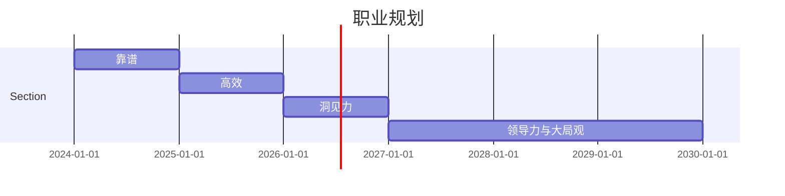

## 👩‍💻个人简介
### <mark><strong>教育经历：</strong></mark>
- 本科：南京大学 - 新闻传播学院 - 广告学

### <mark><strong>实习经历：</strong></mark>
- 2023年04月～2023年06月：罗德公共关系顾问（北京）有限公司上海分公司
- 2023年06月～至今：阿里巴巴集团淘宝（中国）软件有限公司

---

## 📝工作回顾

### 一、团队目标

由于淘宝商家天然的 $$ 预算有限、货品计划性弱、以往达播合作经验较少 $$ 等因素，当下淘宝服饰达播带货合作基础薄弱，而达人带货不仅能够助力当下销售，更重要是帮助商家`做用户渗透、做高公域权重`，带来更多`公转私运营`的空间。


**达播业务拆解：**

<u> 核心：达播梯队建设 <u>
1. S级账号深度孵化合作
2. 服饰高潜垂类深度孵化合作
3. 高潜新咖孵化（回淘）
 
<u> 日常：分行业规模化/定向人货匹配  <u>

### 二、个人目标及结果

>辅助师兄工作，承接日常数据分析需求、大促活动项目管理；逐步牵头箱包、内配两个行业的达播表现，定向货盘输送定向主播，提高匹配精准度，最终达成GMV/DAC目标

### <mark><strong>阶段1:  6.15-7.15</strong></mark>

**O：快速landing，掌握业务背景和目标；了解组织架构及对接关系**

**KR1: 学习部门文档，掌握3个数据；产品工具（FBI、行业360、营销工作台)**
- 复盘4月初选品会规模化撮合策略的有效性（匹配5月-618期间上播数据：GMV/DAC双指标）
- 拆解7月达人的GMV目标，以达成大盘环比+12%

**KR2: 举办1场反季清仓选品会，规模化促成主播与商家建联**
- **背景：** 反季清仓节点，前置（开意识、促达人）规模化组织供给与达人撮合
- **目标：** 集中性盘点供给和主播撮合，批量或单对单点商家与主播建联。
- **结果：** 批量撮合反季选品及季末清仓合作（商家50家+、主播50个+），后续与行业持续、商品中心一起输送反季清仓货盘。核心推动狂暑季、第二波清仓活动期间的主播专场联动+47%。
- **后续调优：** 女装行业规模化策略有效；其他行业需要进一步精细化运营

### <mark><strong>阶段2:  7.15-8.15</strong></mark>

**O：大促活动项目管理；逐步牵头箱包、内配两个行业的达播表现**

**KR1: 作为秋新势力周执行PM，主牵8.10秋新生态会&选品会**
- **背景：** 秋上新节点，前置（开意识、促达人）规模化组织秋冬新品供给与达人撮合
- **目标：** 通过选品会在服饰换季的节点让商家和达人建立联系，最终通过精细化运营撮合达成成交
- **结果：** 批量撮合秋冬上新合作（商家90家+、机构30个+）
- **卡点：** 秋冬供给青黄不接，行业盘点百大新品不是for直播，存在库存浅、客单价高等问题，难以进行精细化运营并撮合
- **后续调优：** 已经跟随师兄、女装行业PM前往供应链基地谈长期合作，收集“源头优选”特色货盘

**KR2: 辅助达人梯队建设工作，通过补贴激励进行达人对赌**
- **目标：** 通过秋季上新新品/品类拉动增量增长
- **策略：** 通过针对特定货盘和场次给与财务补贴、专场扶持等，绑定资源快速做增量
- **结果：** 小四Abby反季专场品类券第一期试跑，初步判断 9元-3元品类券有低成本拉动增量DAC的空间，99-5/199-15更适合拉动客单价，在同一场次内，结合低价商品&中高价商品一起上播，再配置不同额度品类券，可打平整体ROI。
- **问题及后续调优：** 最主要问题-核销率较低。初步业务判断原因：1>主播规模较小，价位不匹配（偏高）、预热也不够，是专场中的混场；2>圈品较窄（仅10款全部羽绒服）、直播节奏（放在中午时段人气不够等）存在问题。后续优化：更前置合作预告，有羽绒小专场并配合有品类券发放，打造全网最优惠心智；主播侧和直播运营侧实时监控数据表现，成交表现好的商品回流。

### <mark><strong>阶段3:  8.15-9.15</strong></mark>

**O：自下而上执行，自上而下思考达播侧整体策略**

**KR1: 建立主播档案，沉淀行业优质商家库**
- **背景：** 淘内主播身份多元、带货风格差异化，主播档案便于横向洞察可渗透空间，进一步提高人货撮合的精准度，带来gmv和dac增量。
- **目标：** 主播侧-深化与淘内主播的建联合作，方便行业和横向小二洞察核心粉丝群体画像、主播成交数据表现等；供给侧-优化供给，洞察达人货盘画像，便于行业加强相似货盘的渗透
- **动作：** 前期联动商品中心提供主播粉丝画像，建立手工表，并定期维护；目前联动数科团队，搭建数据看板
- **结果：** 底层数据开发已完成，预计下周交付数据看板，上线使用。
- **后续调优：** 根据业务理解及试跑效果，进行二次产品迭代，优化流量精准投放。

**KR2: 超级直播代投第一期官号试跑**
- **背景：** 为突破行业直播渠道增长瓶颈，带动行业直播大盘增长，推出直播对赌返点激励计划。
- **目标：** 行业超管代投账号可以实现一对多投放，相当于小二介入采买和投放直播商业化的链路打通。利用月度达播GMV对赌商业化返点作为撬动商家直播间投入抓手，长期为达播增长带来价值。
- **动作：** 已经与财务敲定预算需求，正在联动阿里妈妈产品进行官号迁移，待迁移成功后将进行第一期试跑
- **卡点：** 阿里妈妈达人投放链路存在问题，预计本周二优先为淘宝服饰直播官号开白，本周内第一次投放

**KR3: 与服饰各子行业PM跟进行业特性，梳理达播侧主推商家50+**

**1）箱包行业（8月进展及9月调优）：**
- **策略数据:** 香菇来了 2,736,730 +128%，胡兵-第五空间舱 6,167,047  +545% ，胡可237,790 +1103%
- **策略进展：** 8月持续拓展旅行箱爆款x香菇，打造爆款后持续推给其他头部主播，成交表现显著；女包 unifineX胡可合作上播3场，女包还需扩大拓展风格x品质型商家及爆款；
- **问题不足：** 双肩包货盘有缺失、旅行箱爆款商家帝柏已经出现缺货，预售需要30天以上、风格型女包销量较难有大爆款（衣橱8月共上10款，销量从2w-25w不等，无大爆款）
- **后续调优动作：** 8月下旬箱包供给存在gap，9.1 push行业更新了9月主推货盘，已经统一推送香菇、衣橱、蜜蜂、小玉米、小田、胡兵等头部主播；合作主播趋于选品饱和，本周已经新建联7位中腰部及长尾达人，预计下周批量推送白沟低价货盘

**2）内衣行业（8月进展及9月调优）：**
- **策略数据：** 内衣8月MTD，成交UV 30,639 +31.4%，GMV 83,761,519+5.51%，
- **策略进展：** 重新整理推动DAC爆款货盘，推动头部及中腰部主播合作挂链合作；垂类主播孵化-肖恩，成功带来垂类新增量，行业还在进行组货推动；
- **问题不足：** 还缺内衣类正价、风格型优质商家供给和带货主播；产业带型主播，如肖恩，较难接受组货；
- **后续调优动作：** 9月保暖货盘供给持续增加，预计下周携手商品中心批量输送主播

**3）DAC货盘及挂链进度：**
- **策略复盘：** 本月通过行业自主提报+横向梳理爆款，主推两个DAC货盘：以内配鞋靴为主（含8月包包爆款）的鞋靴内配dac货盘，以及服饰配件（腰带、手套为主）dac货盘，并继续携手商品中心推动挂链。
- **数据表现：** 推动头部主播蜜蜂、衣橱共同挂链-优哲爆款袜子带来6.7w单DAC订单。推动新势力官小小玉米挂链带来2937单。截止到8月31日，DAC货盘共带来7.4w单。
- **后续动作：** 9月将继续主推服饰内配的两个DAC货盘，以内配鞋靴为主，并进行新增的箱包、服装配饰等货盘的推送，以推动主播的商品挂链。并且实时跟进主播对于已选商品的上播进度。

---
## 🎯个人成长

个人成长与思考——`想清楚自己为什么来以及到底要什么？`
1. 持续锻炼运营基本功
- 积累了电商行业的分析框架：数据指标体系、运营逻辑
- 积累了电商零售的业务知识：商业模式、业务策略、行业趋势

2. 通用能力的提升
- 业务能力
原：入职初期，事情几乎都需要师兄把关
现：负责箱包、内配行业和DAC挂链等日常工作，给外包同学布置作业，处理突发情况，做出直接决定。拥有一定商品分析，数据预测和爆款孵化能力。
期望：可以独立与行业沟通月度策略
- 合作能力
原：撮合能力弱，不清楚如何进行人货精准撮合
现：可以与主播机构谈合作，提出诉求和合作方式，进行资源置换。
举例：卡位、流量券、品类券
期望：拓展可控达人池，进一步精准撮合成交
- 工作思维
原：工作流混乱，害怕麻烦他人，喜欢自己解决问题
现：追求高效，利用提高合作方积极性等方式，减少自身重复劳动。就事论事，寻求卡点解决方案。
期望：能够更深刻理解工作背后的目标和逻辑，明确自己在干什么，想干什么，要干什么，为什么

---

## 📅未来规划

